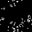
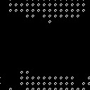

# Game-of-life

## Introduction
This is Conway's version of Game of life. Made as an assignment for Concurrent Computing.  
The simulation is designed to work on xCORE-200 eXplorerKIT.

## Functionality
**The simulation is written in XC.**  
There are 6 available boards/pictures - **16x16, 64x64, 128x128, 512x512 and 1024x1024**.  
Upon F13 button press, the program will distribute the the board within **4 or 8 "workers"** working on  
**different threads**.
It includes:
* Button Listener 
* Orientation Listener
* LED trigger
* Synchronised thread communication using channels

## Examples
 **-----**64x64, 100 Iterations, Time taken:6020 miliseconds**---->**   
 **---**128x128, 100 Iterations, Time taken:17935 miliseconds**--->**   

## Analysis
Beneficial factors:
* Direct parallel communication between workers, so that they don’t trigger a deadlock.
* Packing of 8 cells into a single byte (bit packing) within DataInStream()
* Minimal data transfer across the workers and the distributor
* Workers working synchronized
  
Limitations:
* The number of tiles: with more tiles we could have more workers processing in parallel
* The need for data transfer between distributor and workers whenever a data export is requested

## Possible improvements
* We have multiple ideas on how to improve the program that we couldn’t try due to time restraints:
The data can be compressed even more by grouping clusters together into a “word” and then encoding that word into an ASCII character. That way, even though we would have to save a dictionary for the different encodings, that dictionary would still take less space in processing larger images. This scheme would work very similarly to the LZW compression used in compressing files.
* We can disable and reassign workers that are processing empty (dead) sections of the board. We can decide which workers may need reassigning using previously gathered board data.
* We experimented with storage in the nextGen function. We could replace multiple integer values representing the cells surrounded the current cell, by a single value that simply accumulated the number of alive cells that surrounded the current cell.

